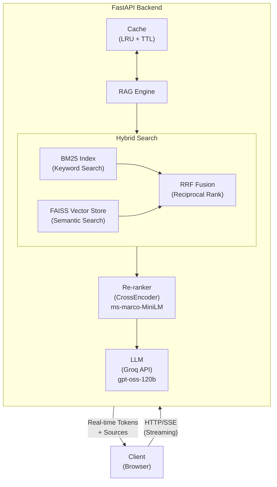

# Vietnamese Public Service Chatbot (ChatBot Dịch vụ Công)

[](https://www.python.org/downloads/)
[](https://fastapi.tiangolo.com)
[](LICENSE)
[](https://www.docker.com/)

A production-ready RAG (Retrieval-Augmented Generation) chatbot system designed specifically for Vietnamese public administrative services. This system provides accurate, context-aware responses about government procedures, FAQs, and public service guidelines using advanced NLP and vector search technologies.

---

## Table of Contents

-   [Features](#features)
-   [Architecture](#architecture)
-   [Tech Stack](#tech-stack)
-   [Prerequisites](#prerequisites)
-   [Installation](#installation)
-   [Configuration](#configuration)
-   [Usage](#usage)
-   [API Documentation](#api-documentation)
-   [Deployment](#deployment)
-   [Testing](#testing)
-   [Performance Optimization](#performance-optimization)
-   [Monitoring & Logging](#monitoring--logging)
-   [Contributing](#contributing)
-   [Troubleshooting](#troubleshooting)
-   [License](#license)

## Features

This chatbot brings powerful AI capabilities to help citizens access public services more easily.

### Core Capabilities

-   **Intelligent RAG System**: Combines vector search (FAISS) with LLM for accurate responses
-   **Multilingual Support**: Optimized for Vietnamese with multilingual embedding models
-   **High Performance**: Sub-second response time with intelligent caching
-   **Production-Ready**: Security-hardened with rate limiting, CORS, and API key management
-   **Context Analysis**: Advanced context relevance scoring and filtering
-   **Smart Caching**: LRU cache with configurable TTL for repeated queries
-   **Docker Support**: Fully containerized for easy deployment
-   **Monitoring**: Comprehensive logging with trace IDs and performance metrics
-   **Hot Reload**: Dynamic data updates without system restart

### Advanced Features

-   **Hybrid Search**: Combines FAISS semantic search with BM25 keyword search using RRF fusion
-   **Re-ranking**: CrossEncoder model (`ms-marco-MiniLM-L-6-v2`) re-scores retrieved documents for better relevance
-   **Semantic Search**: L2-normalized embeddings for accurate similarity matching
-   **Streaming Responses**: Real-time token streaming via Server-Sent Events (SSE)
-   **Threshold-based Filtering**: Intelligent fallback for low-confidence results
-   **Source Attribution**: Every response includes verifiable source references
-   **Batch Processing**: Optimized embedding generation for large datasets
-   **Chat History Context**: Maintains conversation context for follow-up questions
-   **Sub-path Deployment**: Configurable BASE_PATH for flexible deployment scenarios
-   **Health Checks**: Liveness and readiness probes for orchestration
-   **Error Recovery**: Graceful degradation with retry mechanisms
-   **Rich Markdown Support**: Full GFM (GitHub Flavored Markdown) rendering with tables, code blocks, and more

## Architecture



### Data Flow

1. **Query Processing**: User query → Embedding generation → Vector normalization
2. **Hybrid Retrieval**:
    - FAISS similarity search (semantic)
    - BM25 keyword search
    - Reciprocal Rank Fusion (RRF) to combine results
3. **Re-ranking**: CrossEncoder re-scores documents for relevance
4. **Generation**: Context assembly → Prompt construction → LLM streaming inference
5. **Response**: Streaming answer with real-time tokens → Source attribution → Cache storage
6. **Delivery**: Server-Sent Events (SSE) stream with contexts and metadata

## Tech Stack

### Backend Framework

-   **FastAPI**: Modern, high-performance web framework
-   **Uvicorn/Gunicorn**: ASGI server with worker management
-   **Pydantic**: Data validation and settings management

### AI/ML Components

-   **Sentence Transformers**: Multilingual embedding generation
    -   Model: `paraphrase-multilingual-MiniLM-L12-v2`
-   **FAISS**: Efficient vector similarity search (Facebook AI)
-   **BM25 (Okapi)**: Keyword-based search using rank-bm25
-   **CrossEncoder**: Document re-ranking for relevance
    -   Model: `cross-encoder/ms-marco-MiniLM-L-6-v2`
-   **Groq**: High-performance LLM API
    -   Default Model: `openai/gpt-oss-120b`

### Data Processing

-   **NumPy**: Numerical operations and vector manipulation
-   **scikit-learn**: Normalization and preprocessing utilities
-   **rank-bm25**: BM25 keyword search implementation
-   **Python JSON Logger**: Structured logging for production

### Infrastructure

-   **Docker**: Containerization and deployment
-   **Docker Compose**: Multi-service orchestration
-   **Python dotenv**: Environment variable management

## Prerequisites

### System Requirements

-   **Python**: 3.12.3 or higher (3.10+ minimum supported)
-   **RAM**: Minimum 1.5GB (2GB+ recommended for production)
-   **Disk Space**: ~3GB for models and dependencies
-   **OS**: Linux, macOS, or Windows

### Optional (Recommended for Performance)

-   **GPU**: CUDA-compatible GPU for faster embedding generation
-   **Docker**: Version 20.10+ with Docker Compose

### API Keys

You'll need a **Groq API Key** for LLM functionality:

-   Get your free API key at: [https://console.groq.com](https://console.groq.com)

## Installation

Choose the installation method that best fits your needs:

### Method 1: Local Development Setup

#### 1. Clone the Repository

```bash
git clone https://github.com/PhucHuwu/ChatBot_Dich_vu_cong.git
cd ChatBot_Dich_vu_cong
```

#### 2. Create Virtual Environment

```bash
# Using venv
python -m venv venv

# Activate on Linux/macOS
source venv/bin/activate

# Activate on Windows
venv\Scripts\activate
```

#### 3. Install Dependencies

```bash
# Install production dependencies
pip install -r requirements.txt

# Or for development (includes testing tools)
pip install -r requirements-dev.txt
```

#### 4. Set Up Environment Variables

```bash
# Copy example environment file (if available)
cp .env.example .env

# Edit .env with your configuration
# REQUIRED: Set your GROQ_API_KEY
```

#### 5. Build Vector Index

```bash
# Build FAISS index from data sources
python -c "from rag import build_index; build_index()"
```

#### 6. Run the Server

```bash
# Development mode
uvicorn app:app --reload --host 0.0.0.0 --port 8000

# Production mode
gunicorn app:app \
  --workers 4 \
  --worker-class uvicorn.workers.UvicornWorker \
  --bind 0.0.0.0:8000 \
  --timeout 120 \
  --log-level info
```

### Method 2: Docker Deployment

**Recommended for production environments and quick setup.**

#### 1. Using Docker Compose (Recommended)

```bash
# Create .env file with required variables
echo "GROQ_API_KEY=your_api_key_here" > .env

# Build and start services
docker-compose up -d

# View logs
docker-compose logs -f

# Stop services
docker-compose down
```

#### 2. Using Docker Directly

```bash
# Build image
docker build -t chatbot-dichvucong:latest .

# Run container
docker run -d \
  --name chatbot \
  -p 8000:8000 \
  -e GROQ_API_KEY=your_api_key \
  -v $(pwd)/embeddings:/app/embeddings \
  -v $(pwd)/data:/app/data:ro \
  chatbot-dichvucong:latest
```

### Method 3: Development with Hot Reload

```bash
# Install development dependencies
pip install -r requirements-dev.txt

# Run with auto-reload
uvicorn app:app --reload --host 0.0.0.0 --port 8000
```

## Configuration

### Environment Variables

Create a `.env` file in the project root. See [`.env.example`](.env.example) for a complete list of configuration options.

**Required configuration:**

```bash
# Required - Get your API key from https://console.groq.com
GROQ_API_KEY=your_groq_api_key_here
```

**Important optional configurations:**

```bash
# Deployment path - Important for sub-path deployments
# Leave empty "" for root deployment: https://domain.com/
# Set to sub-path for nested deployment: https://domain.com/chatbot
# Must be synchronized with frontend/config.js BASE_PATH
BASE_PATH=/chatbot

# CORS - Customize for your domain
ALLOWED_ORIGINS=https://yourdomain.gov.vn,https://api.yourdomain.gov.vn

# Re-ranking - Improve result relevance (default: enabled)
ENABLE_RERANKING=True
RERANKING_MODEL=cross-encoder/ms-marco-MiniLM-L-6-v2
RERANKING_TOP_K=5

# Hybrid Search - Combine semantic + keyword search (default: enabled)
ENABLE_HYBRID_SEARCH=True
HYBRID_FUSION_METHOD=rrf
BM25_WEIGHT=0.5
VECTOR_WEIGHT=0.5
```

**Other optional configurations** (with sensible defaults):

-   Application settings (APP_ENV, DEBUG, HOST, PORT, WORKERS)
-   LLM configuration (model, temperature, max tokens, timeout, reasoning effort)
-   Embedding settings (model, batch size, device)
-   Vector search parameters (similarity threshold, top K results)
-   Caching, logging, rate limiting, security options

For the complete list of configuration options with detailed explanations, see [`.env.example`](.env.example).

### Configuration Validation

The system automatically validates critical configurations on startup (see [`config.py`](config.py)):

-   `GROQ_API_KEY` is set
-   Data directory exists
-   Debug mode disabled in production
-   CORS origins properly configured

## Usage

### Web Interface

1. **Access the Frontend**

    ```
    http://localhost:8000/frontend/index.html
    ```

2. **Interact with the Chatbot**
    - Type your question in Vietnamese
    - Press Enter or click Send
    - View responses with source attributions
    - Supports markdown formatting in responses

### API Usage

#### Example: Chat Streaming Request

The API uses Server-Sent Events (SSE) for real-time streaming responses:

```bash
curl -N -X POST "http://localhost:8000/api/chat/stream" \
  -H "Content-Type: application/json" \
  -d '{
    "query": "Làm thế nào để đăng ký thường trú?",
    "chat_history": [],
    "conversation_id": "conv-123"
  }'
```

#### Streaming Response Format

The response streams multiple events via SSE:

**1. Metadata Event** (sent first):

```json
{
    "type": "metadata",
    "query": "Làm thế nào để đăng ký thường trú?",
    "contexts": [
        {
            "text": "Thủ tục đăng ký thường trú...",
            "type": "guide",
            "category": "Đăng ký cư trú",
            "href": "https://dichvucong.gov.vn/...",
            "title": "Đăng ký thường trú"
        }
    ],
    "sources": [
        {
            "source": "Nguồn 1",
            "type": "guide",
            "title": "Đăng ký thường trú",
            "href": "https://dichvucong.gov.vn/..."
        }
    ]
}
```

**2. Content Events** (streamed incrementally):

```json
{
    "type": "content",
    "content": "Để đăng ký thường trú, bạn cần..."
}
```

**3. Done Event** (sent last):

```json
{
    "type": "done",
    "process_time": 1.234,
    "trace_id": "abc123-def456-ghi789",
    "success": true
}
```

**4. Error Event** (if an error occurs):

```json
{
    "type": "error",
    "error": "Error message",
    "trace_id": "abc123-def456-ghi789",
    "success": false
}
```

### Rebuilding the Index

When you update data files in the `data/` directory (such as `faq.json` and `guide.json`):

> **Note:** Data JSON files are excluded from version control but are required for the application to function. Make sure they exist locally.

#### Linux/macOS:

```bash
./scripts/rebuild_index.sh
```

#### Windows:

```powershell
.\scripts\rebuild_index.ps1
```

#### Programmatically:

```python
from rag import build_index
build_index(batch_size=32)
```

## API Documentation

### Endpoints Overview

| Endpoint           | Method | Description                        | Auth Required |
| ------------------ | ------ | ---------------------------------- | ------------- |
| `/`                | GET    | Frontend homepage                  | No            |
| `/health`          | GET    | Basic health check                 | No            |
| `/api/status`      | GET    | Detailed system status             | No            |
| `/api/chat/stream` | POST   | Chat with streaming response (SSE) | No            |
| `/api/build`       | POST   | Rebuild vector index               | No            |
| `/api/cache/stats` | GET    | Get cache statistics               | No            |
| `/api/cache/clear` | POST   | Clear cache                        | No            |
| `/api/suggestions` | GET    | Get suggested questions            | No            |
| `/api/docs`        | GET    | Interactive API docs (Swagger)     | No            |
| `/api/redoc`       | GET    | API documentation (ReDoc)          | No            |

### Key Endpoints

**Most important endpoints:**

-   `POST /api/chat/stream` - Main chat endpoint with streaming response (SSE)
-   `GET /health` - Health check
-   `GET /api/status` - System status with cache, device info, re-ranker and hybrid search status

**Example Chat Request:**

```bash
curl -N -X POST "http://localhost:8000/api/chat/stream" \
  -H "Content-Type: application/json" \
  -d '{
    "query": "Thủ tục cấp CMND mất cần gì?",
    "chat_history": [],
    "conversation_id": "conv-123"
  }'
```

**Streaming response includes:**

-   Multiple SSE events with `data:` prefix
-   `metadata` event - Retrieved contexts and sources
-   `content` events - Streamed answer tokens
-   `done` event - Completion with process time and trace_id
-   `error` event - Error details if something fails

### Interactive Documentation

When `EXPOSE_DOCS=True`, access:

-   **Swagger UI**: `http://localhost:8000/api/docs`
-   **ReDoc**: `http://localhost:8000/api/redoc`

## Deployment

### Production Deployment Checklist

-   [ ] Set `APP_ENV=production` in environment variables
-   [ ] Set `DEBUG=False` in environment variables
-   [ ] Configure `ALLOWED_ORIGINS` with your actual domain(s)
-   [ ] Configure `BASE_PATH` if deploying to a sub-path (must sync with frontend/config.js)
-   [ ] Set `EXPOSE_DOCS=False` for production security
-   [ ] Use valid `GROQ_API_KEY` from Groq console
-   [ ] Configure re-ranking: `ENABLE_RERANKING=True` (recommended)
-   [ ] Configure hybrid search: `ENABLE_HYBRID_SEARCH=True` (recommended)
-   [ ] Set up HTTPS/TLS termination (Nginx/Traefik/Caddy)
-   [ ] Configure reverse proxy with proper timeouts (at least 60s for streaming)
-   [ ] Set up log aggregation if needed
-   [ ] Set up automated backups for `embeddings/` directory (includes FAISS and BM25 indexes)
-   [ ] Enable rate limiting with `ENABLE_RATE_LIMIT=True` if needed
-   [ ] Configure firewall rules for your infrastructure
-   [ ] Set appropriate resource limits (CPU/Memory) based on load
-   [ ] Build indexes before deploying: `python -c "from rag import build_index; build_index()"`

### Docker Production Deployment

```bash
# 1. Build production image
docker build -t chatbot-dichvucong:v1.0.0 .

# 2. Run with production settings
docker run -d \
  --name chatbot-production \
  --restart unless-stopped \
  -p 8000:8000 \
  -e APP_ENV=production \
  -e DEBUG=False \
  -e GROQ_API_KEY=${GROQ_API_KEY} \
  -e WORKERS=2 \
  -e LOG_LEVEL=INFO \
  -e ENABLE_CACHE=True \
  -e CACHE_MAX_SIZE=500 \
  -e CACHE_TTL=3600 \
  -v $(pwd)/embeddings:/app/embeddings \
  -v $(pwd)/data:/app/data:ro \
  --memory="1536M" \
  --cpus="1.0" \
  chatbot-dichvucong:v1.0.0
```

## Contributing

We welcome contributions from the community! Whether you're fixing bugs, adding features, improving documentation, or reporting issues, your help is appreciated.

### Quick Start for Contributors

1. **Fork and clone** the repository
2. **Create a feature branch**: `git checkout -b feature/your-feature-name`
3. **Make your changes** following our code style guidelines
4. **Write/update tests** for your changes
5. **Commit** using [Conventional Commits](https://www.conventionalcommits.org/) format (e.g., `feat:`, `fix:`, `docs:`)
6. **Submit a pull request** with a clear description

### Code Standards

-   **Style**: Follow PEP 8, use Black for formatting
-   **Testing**: Maintain 70%+ test coverage
-   **Documentation**: Add docstrings for public functions
-   **Type hints**: Required for new code

### Before Submitting

```bash
# Run these checks
pytest                  # All tests must pass
black .                 # Format code
flake8                  # Lint code
```

### Detailed Guidelines

For comprehensive information on:

-   Development setup and environment configuration
-   Detailed coding standards and best practices
-   Testing guidelines and coverage requirements
-   Pull request process and review criteria
-   Issue reporting templates
-   Community guidelines and communication

Please read our [**CONTRIBUTING.md**](CONTRIBUTING.md) guide.

### Code of Conduct

This project adheres to a [Code of Conduct](CODE_OF_CONDUCT.md). By participating, you are expected to uphold this code. Please report unacceptable behavior through GitHub issues or contact maintainers directly.

## Troubleshooting

### Common Issues

#### 1. Index Not Found Error

**Problem:**

```
FileNotFoundError: embeddings/faiss_index.bin not found
```

**Solution:**

```bash
# Rebuild the index
python -c "from rag import build_index; build_index()"
```

#### 2. GROQ API Key Error

**Problem:**

```
ValueError: GROQ_API_KEY is required
```

**Solution:**

```bash
# Set API key in .env file
echo "GROQ_API_KEY=your_key_here" >> .env
```

#### 3. GPU Not Detected

**Problem:**

```
WARNING: CUDA not available, using CPU
```

**Solution:**

```bash
# Install CUDA-enabled PyTorch
pip install torch --index-url https://download.pytorch.org/whl/cu118

# Or force CPU mode
echo "EMBEDDING_DEVICE=cpu" >> .env
```

#### 4. Port Already in Use

**Problem:**

```
OSError: [Errno 48] Address already in use
```

**Solution:**

```bash
# Find and kill process using port 8000
# Linux/macOS:
lsof -ti:8000 | xargs kill -9

# Windows:
netstat -ano | findstr :8000
taskkill /PID <PID> /F

# Or use different port
uvicorn app:app --port 8001
```

#### 5. Out of Memory Error

**Problem:**

```
RuntimeError: CUDA out of memory
```

**Solution:**

```bash
# Reduce batch size
echo "EMBEDDING_BATCH_SIZE=16" >> .env

# Or use CPU
echo "EMBEDDING_DEVICE=cpu" >> .env
```

#### 6. Slow Response Times

**Diagnosis:**

```bash
# Check logs for timing breakdown
docker logs chatbot | grep "duration_ms"
```

**Solutions:**

-   Enable caching: `ENABLE_CACHE=True`
-   Reduce `TOP_K_DEFAULT` to 5-7
-   Increase `SIMILARITY_THRESHOLD` to 1.0
-   Use GPU: `EMBEDDING_DEVICE=cuda`
-   Disable re-ranking if not needed: `ENABLE_RERANKING=False`
-   Disable hybrid search if not needed: `ENABLE_HYBRID_SEARCH=False`
-   Reduce `INITIAL_RETRIEVAL_MULTIPLIER` to 2 if re-ranking is enabled

#### 7. BM25 Index Not Found (Hybrid Search Enabled)

**Problem:**

```
FileNotFoundError: embeddings/bm25_index.pkl not found
```

**Solution:**

```bash
# Rebuild both FAISS and BM25 indexes
python -c "from rag import build_index; build_index()"

# Or disable hybrid search if not needed
echo "ENABLE_HYBRID_SEARCH=False" >> .env
```

#### 8. Docker Build Fails

**Problem:**

```
ERROR: failed to solve: process "/bin/sh -c pip install..." did not complete
```

**Solution:**

```bash
# Clear Docker cache
docker builder prune -a

# Build with no cache
docker build --no-cache -t chatbot-dichvucong .
```

### Debug Mode

Enable detailed logging:

```bash
# In .env
DEBUG=True
LOG_LEVEL=DEBUG
```

### Health Check Scripts

#### Linux/macOS:

```bash
./scripts/health_check.sh
```

#### Windows:

```powershell
.\scripts\health_check.ps1
```

See the `scripts/` directory for all available scripts.

### Getting Help

If you encounter any issues, we're here to help:

1. **Check Documentation**: Review this README and inline code comments
2. **Search Issues**: Check [existing GitHub Issues](https://github.com/PhucHuwu/ChatBot_Dich_vu_cong/issues) for similar problems
3. **Enable Debug Logging**: Set `LOG_LEVEL=DEBUG` for detailed diagnostics
4. **Create Issue**: If the problem persists, please create a new issue with logs, configuration, and steps to reproduce

## License

This project is licensed under the MIT License - see the [LICENSE](LICENSE) file for details.

## Authors & Acknowledgments

### Main Contributors

-   **PhucHuwu** - Project Creator and Maintainer

### Technologies & Libraries

-   [FastAPI](https://fastapi.tiangolo.com/) - Web framework
-   [Sentence Transformers](https://www.sbert.net/) - Embedding models
-   [FAISS](https://github.com/facebookresearch/faiss) - Vector search by Meta AI
-   [Groq](https://groq.com/) - LLM inference platform
-   [Hugging Face](https://huggingface.co/) - Model hosting

### Inspiration

This project was created to improve access to Vietnamese public administrative services through AI-powered assistance.

## Contact & Support

-   **Issues**: [GitHub Issues](https://github.com/PhucHuwu/ChatBot_Dich_vu_cong/issues)
-   **Discussions**: [GitHub Discussions](https://github.com/PhucHuwu/ChatBot_Dich_vu_cong/discussions)

## Additional Resources

-   [FastAPI Documentation](https://fastapi.tiangolo.com/)
-   [FAISS Wiki](https://github.com/facebookresearch/faiss/wiki)
-   [Sentence Transformers Documentation](https://www.sbert.net/)
-   [Groq API Documentation](https://console.groq.com/docs)
-   [Docker Documentation](https://docs.docker.com/)

---

<div align="center">

**Made by Phuc Tran Huu and his friends - ITPTIT**

[⬆ Back to Top](#vietnamese-public-service-chatbot-chatbot-dịch-vụ-công)

</div>
